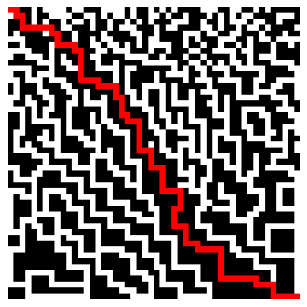
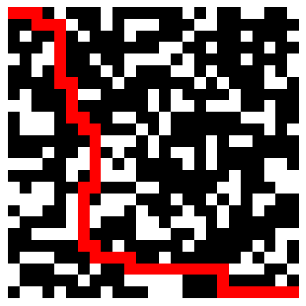

# Bludiste_projekt_vvp
Tento repozitář obsahuje projekt do předmětu Vědecké výpočty v pythonu.

Projekt se skládá ze 4 souborů:
    
    Bludiste - zde je vytvořena třída Bludiste a metody nacteni_z_csv, která načítá csv soubor do numpy tabulky s True/False hodnotami, a prazdne a slalom, což  jsou šablony, které poté budou využity při generování bludišt.

    Resitel - Zde je definována funkce pro tvorbu incidenční matice z načtené numpy tabulky a funkce nejkratsi_cesta, která implementuje BFS algoritmus a na základě incidenční matice najde nejkratší cestu bludištěm

    Vykresleni - zde je definována funkce, která vykresluje bludiště a nalezenou nejkratší cestu

    generator - tento soubor obsahuje funkci generuj, která má dva vstupní parametry - velikost a "prazdne" nebo "slalom", což znamená šablona, kterou má funkce pro generování bludiště použít

    Dále je ve složce projektu složka Data, která obsahuje zkušební matici 50x50, na které se mohou otestovat vytvořené funkce, a notebook Funkcnost_zkouska, ve kterém jsou funkce demonstrovány v jednoduchém kódu.

    Níže přikládám vygenerované obrázky bludišť a najitých cest v tomto projektu:
    
    

    